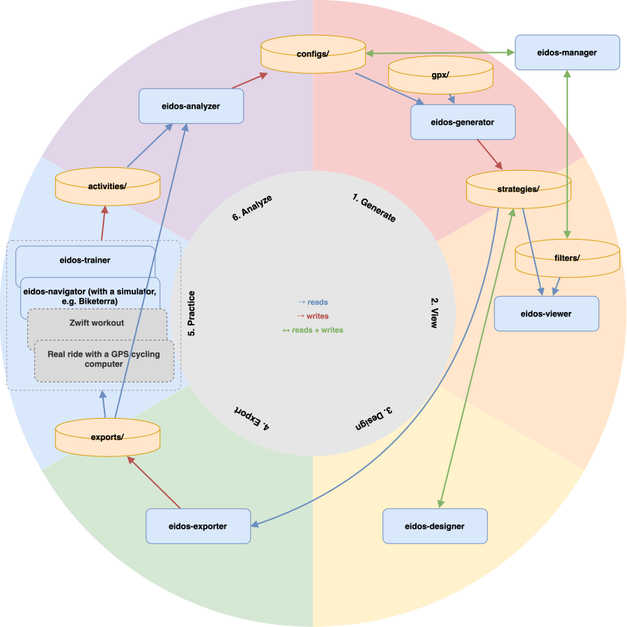
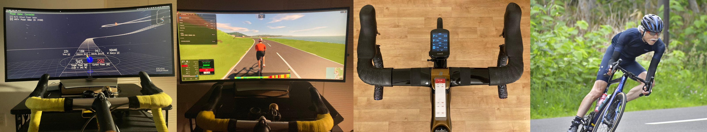

# (EIDOS/HYLE)^TT

(EIDOS/HYLE)^TT = (EIDOS^TT) / (HYLE^TT)

- **Numerator — EIDOS^TT**: Exact Intelligent Design Of Strategy for Time Trials
- **Denominator — HYLE^TT**: High-fidelity Yield of Logistics for EIDOS^TT


EIDOS^TT is a **workbench that takes a cycling time-trial pacing strategy from generation through race-day analysis**, built around a physics-based optimizer that searches for the fastest feasible strategy — plus a small set of supporting logistics tools (HYLE^TT).

Unlike conventional pacing tools, EIDOS^TT encodes no course-specific racing heuristics. Strategy structure emerges from the interaction of physics, physiology, and optimization.

---

## What EIDOS^TT Is

<!-- If you have the free time to tune this, you have the free time to train instead — a fact this tool will eventually demonstrate to you. Also: it helps to believe you're the "Intelligent" part. -->

EIDOS^TT searches for near-optimal power strategies for cycling time trials — a spread of comparably-good candidates across many independent search runs, not a single verified-best answer — by combining three ingredients: a physics-based race simulator, a physiological W' (work-capacity) model, and a differential-evolution optimizer.

**Physics**: The race simulator models the forces actually acting on a rider — aerodynamic drag (via CdA, adjusted for wind angle), rolling resistance, gravity on gradients, and cornering speed capped by tire-road friction and braking — driven by the real course geometry and wind conditions rather than a simplified profile. The same simulator kernel runs inside Generator, Designer, and Trainer, so a strategy behaves identically whether it's being optimized, previewed, or ridden.

**Physiology**: Rider W' (anaerobic work capacity) depletion and recovery are based on a formulation of the Skiba/Clarke W' balance (W'BAL) model: W' is consumed when power exceeds Critical Power (CP), and recovers via the W'BAL-KODE formulation (Skiba & Clarke, 2021) when power falls below CP. W' = 0 is not a physiological collapse point — it is one state in the model, and optimal strategies often approach W' exhaustion near the finish.

**Optimization**: A differential-evolution search proposes the strategy, searching for the fastest feasible pacing from only the course geometry, rider model, and physical constraints. It is deliberately blind to course semantics — never told where climbs begin, where descents end, or where to attack or recover. Rules like "push harder before climbs," "recover on descents," or "increase power into headwinds" are never encoded; segment boundaries that align with gradient changes or speed limits emerge from the physics, not from programmed assumptions.

Each of these is a registry entry, not a fixed implementation: `sim_kiritsubo` (physics + physiology) and `opt_tenchi` (optimization) are the current defaults, not the only possible ones — see [`docs/ADDING_A_SIMULATOR_OR_OPTIMIZER.md`](docs/ADDING_A_SIMULATOR_OR_OPTIMIZER.md) for how to add another.

EIDOS^TT is less a simulator than a workbench. The optimizer's search surfaces the fastest candidate strategies it can find, but that's just the entry point — the real product is the pipeline built around it — viewing, designing, exporting, executing, and analyzing — that lets a rider research and construct a strategy rather than simply receive one. The simulator is one instrument on that bench, not the product itself.

The "Intelligent" in the name refers to the **user**, not the software. EIDOS^TT is intended for athletes who understand CP and W', are willing to examine model assumptions, and prefer informed judgment over black-box recommendations.

---

## Project Structure: EIDOS^TT and HYLE^TT

**EIDOS^TT** is the strategy-computation side: the optimizer, simulator, and the GUIs behind each stage of the [Workflow](#workflow) below. In normal use, only `eidos-manager` is launched from the command line — it opens the next app as each stage is reached, so a full pass through the pipeline stays inside one GUI session; every app is also independently runnable on its own for scripting or debugging a single stage.

| App | Purpose |
|---|---|
| `eidos-manager` | Project and configuration management GUI (primary entry point) |
| `eidos-generator` | Optimization pipeline: differential evolution over a physics-based simulator |
| `eidos-viewer` | Strategy visualization and comparison across seeds and segment counts |
| `eidos-designer` | Manual strategy refinement with live re-simulation |
| `eidos-exporter` | FIT / ZWO / PDF export of a finalized strategy |
| `eidos-trainer` | Physics-identical virtual ride using live ANT+ power input |
| `eidos-navigator` | Reads a cycling simulator's on-screen position via OCR (e.g. Biketerra) and switches the displayed target power to match that point in the strategy |
| `eidos-analyzer` | Post-ride analysis: overlay a simulated strategy against an actual ride FIT file |

**HYLE^TT** is the supporting-logistics side: standalone tools that prepare or inspect the raw material the EIDOS^TT pipeline consumes or produces — course files, ride history, activity conversions — but that don't themselves belong to the strategy-optimization loop.

| App | Purpose |
|---|---|
| `hyle-course-checker` | Interactive 3D/graph viewer for a generated course's spline-interpolated geometry |
| `hyle-cpmodel-estimator` | Estimate a rider's Critical Power model (CP, W', Pmax) from GoldenCheetah ride history |
| `hyle-fit2gpx-converter` | FIT → GPX converter with an optional interactive trim range |
| `hyle-fit-combiner` | Merge a directory of FIT files into a single activity |
| `hyle-strategy-doctor` | Detect and repair `_index.parquet` / strategy JSON mismatches under `resources/strategies/` |

For how the source is actually laid out inside each side (`core/`, `eidos/lib/`, `hyle/lib/`, the simulator/optimizer registries, module-by-module) and the design rules behind the EIDOS/HYLE split, see [`docs/ARCHITECTURE.md`](docs/ARCHITECTURE.md).

---

## Workflow

EIDOS^TT follows a complete pipeline from optimization to execution — but it isn't a closed loop back to the same starting point. Analysis (step 6) can feed a refined or calibrated rider/environment config back into a fresh Generate (step 1), so the six steps form a spiral: each pass around can start from better-informed parameters than the last, rather than repeating the same run.

The spiral is not just conceptual — each app reads from and writes to specific subdirectories under `resources/`, and it's exactly that write-then-read handoff between apps that makes the loop close. The diagram below lays every `eidos-*` app and `resources/` subdirectory out on a circle ordered by that data flow:



### 1. Generate

https://github.com/user-attachments/assets/dc5e1aa1-f1c1-4d5c-8e30-9167f3fb3bd8

Load a GPX course file and rider parameters. Run multi-start differential evolution across a range of segment counts. All candidate strategies are saved as compressed JSON files with a Parquet index.

### 2. View

https://github.com/user-attachments/assets/98941452-a3be-4c1e-8821-7f2f37fac888

Inspect all candidate strategies in the Viewer, narrowed to the ones worth comparing by reusable filter criteria (edited in the Manager). Overlay and compare across seeds and segment counts. Assess convergence quality visually and select one strategy to carry forward.

### 3. Design

https://github.com/user-attachments/assets/71997964-17a8-4dfd-8df8-2ea0e52d34f0

Open the selected strategy in the Designer for manual refinement. Segment powers and lengths can be edited interactively while the simulator recalculates performance in real time, and saving writes the edited version as a new strategy record alongside the original, rather than overwriting it.

### 4. Export

https://github.com/user-attachments/assets/f090648b-95e4-4051-a7da-24cd98ea4c90

Export the finalized strategy as:

- The strategy record itself (JSON)
- Garmin FIT course files
- Zwift ZWO workout files
- Printable PDF stem cards

### 5. Execute

https://github.com/user-attachments/assets/62e99249-2cfc-44ba-8226-3acc83a5fbbe

Internalize the strategy through repeated execution — in a simulator, on the road, or during the race itself.

- **Trainer** tracks real ANT+ power output against the target strategy with full accuracy.
- **Navigator** reads your current position from a cycling simulator's screen (e.g. Biketerra) via OCR, and switches the displayed target power to match that position in the strategy — so pacing guidance stays synced to wherever the simulator says you actually are on the course.
- **Zwift ZWO** workouts allow pacing-pattern practice independent of course context.
- **Garmin FIT course**, loaded onto a Garmin or similar GPS cycling computer, displays the target power in real time during an actual outdoor ride or race.
- **PDF stem card**, cut out and taped to the bike stem, lets the rider read the target-power switch points against the distance shown on their computer — no extra electronics needed.



Whichever method is used, the resulting ride is saved as a FIT file in `activities/`, ready for the Analyzer to compare against the plan. For that comparison to work, stand still for a few seconds right before departure — as in a real standing-start TT — and leave a little recording margin before the start and after the finish.

### 6. Analyze

https://github.com/user-attachments/assets/ece06f45-db8a-4397-b53e-a9022a6fbfe4

After a real race or practice ride, use the **Analyzer** to match the recorded FIT file to the course (if it doesn't match, see `docs/RUNBOOK.md`'s "Analyzer fails to match a recorded FIT file to its course" entry) and overlay it against the planned strategy. Its core use is a Rebuild-and-compare workbench: re-simulate using the actual course geometry, recorded power, or hand-adjusted physics parameters, and compare the result against both the plan and the real ride — repeating with different manual values to work out what actually explains the gap. See [`docs/ANALYZER_COMPARISON.md`](docs/ANALYZER_COMPARISON.md) for how the Activity, Strategy, and Rebuild lines are actually lined up against each other.

**Auto Fit** is an optional addition to this loop: instead of manually searching for physics parameter values, it runs an automated search against the ride's recorded data. See [`docs/ANALYZER_AUTO_FIT.md`](docs/ANALYZER_AUTO_FIT.md) for details.

A hand-tuned or Auto-Fit-calibrated rebuild in the Analyzer isn't just a read-only comparison line: it can be written out as a new rider/environment config (the same shape Manager, Designer, and Trainer already read), informed by how the rider actually performed — not just how they were assumed to.

---

## Requirements

- Python 3.12
- macOS (Apple Silicon) — currently the only officially supported platform
- Tesseract OCR (required by Navigator): `brew install tesseract`
- ANT+ USB dongle (required by Trainer): also needs the system `libusb` library (`brew install libusb`) for `pyusb`/`openant` to talk to it — without it, ANT+ initialization fails (logged as `PHYSICAL_NODE_MISSING`) and Trainer falls back to the Virtual Power Meter, which is otherwise a normal, fully-usable mode (see `docs/RUNBOOK.md`'s "ANT+ dongle never initializes" entry)

---

## Installation

Install as an editable package:

```bash
git clone https://github.com/satosaga/eidos-hyle-tt.git
cd eidos-hyle-tt
python3.12 -m venv venv
source venv/bin/activate
pip install -e .
```

Every application is then available as a command on `PATH`.

### For contributors

An optional [pre-commit](https://pre-commit.com/) hook suite enforces ruff plus several project-specific consistency checks (a version-bump policy for simulator/optimizer/`data_manager.py` changes, registry bookkeeping, doc-code cross-references, and a known-mypy-errors baseline). See [`CONTRIBUTING.md`](CONTRIBUTING.md) to set it up.

---

## Quick Start

1. **Launch the Manager**: Run `eidos-manager` to open the central control panel.
2. **Try with Sample Data**: Load the bundled sample course (`resources/gpx/sample_course.gpx`) and config template (`resources/configs/templates/sample_config.json`) to test the optimization pipeline immediately.
3. **Follow the Workflow**: Move seamlessly through the pipeline: Generate → View → Design → Export → Execute → Analyze.

To use your own data: GPX and CP/W'/Pmax can come from anywhere. `hyle-fit2gpx-converter` turns a past FIT into a GPX course; `hyle-cpmodel-estimator` estimates CP/W'/Pmax from GoldenCheetah history using an explicit Morton model (Morton, 1996).

---

## Further documentation

- [`docs/ANALYZER_AUTO_FIT.md`](docs/ANALYZER_AUTO_FIT.md) — how to use the Analyzer's Auto Fit, Sensitivity, and Diagnostics features.
- [`docs/ANALYZER_COMPARISON.md`](docs/ANALYZER_COMPARISON.md) — how the Analyzer matches a recorded Activity to its course and lines it up against the Strategy/Rebuild traces for comparison.
- [`docs/ARCHITECTURE.md`](docs/ARCHITECTURE.md) — living reference for design rules still in effect (EIDOS/HYLE symmetry, what belongs in `core/`, the reproducibility-tracking design, etc.).
- [`docs/RUNBOOK.md`](docs/RUNBOOK.md) — task-oriented: what to do about a missing `_index.parquet`, a reproducibility warning, a blocked commit, first-time setup, and so on.
- [`docs/ADDING_A_SIMULATOR_OR_OPTIMIZER.md`](docs/ADDING_A_SIMULATOR_OR_OPTIMIZER.md) — how to add a new physics kernel under `core/simulators/` or a new search strategy under `eidos/lib/optimizers/`, with a copy-paste template and a checklist of everything that needs to stay in sync.
- [`CONTRIBUTING.md`](CONTRIBUTING.md) — what kind of contributions are welcome, dev environment setup, and what to check before opening a PR.
- [`SECURITY.md`](SECURITY.md) — how to report a vulnerability.

---

## References

Skiba, P.F., Chidnok, W., Vanhatalo, A., & Jones, A.M. (2012). Modeling the expenditure and reconstitution of work capacity above critical power. *Medicine & Science in Sports & Exercise*, 44(8), 1526–1532.

Skiba, P.F., & Clarke, D.C. (2021). The W′ balance model: mathematical and methodological considerations. *International Journal of Sports Physiology and Performance*, 16(11), 1561–1572.

Morton, R.H. (1996). A 3-parameter critical power model. *Ergonomics*, 39(4), 611–619.

---

## Acknowledgments

Multiple LLMs (Claude, Gemini, ChatGPT, Grok) were used as coding and documentation aids.

---

## Author

Sato SAGA ([ORCID: 0000-0002-4484-1464](https://orcid.org/0000-0002-4484-1464))

---

## License

Copyright (C) 2026 Sato SAGA

GNU General Public License v3.0 or later — see [LICENSE](LICENSE) for details.
